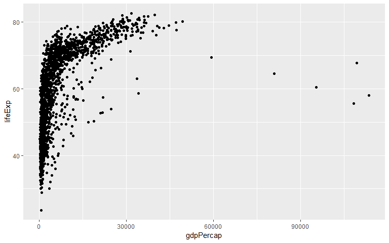
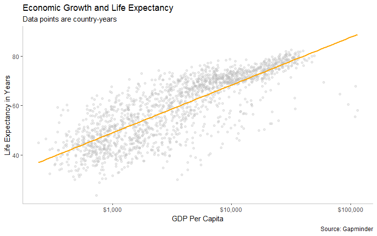
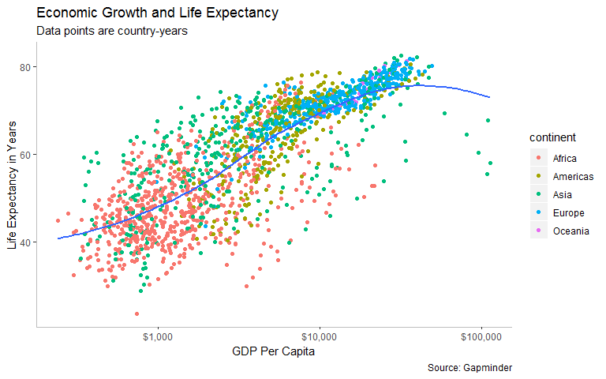
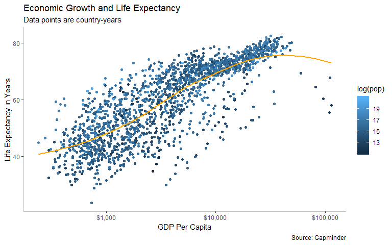
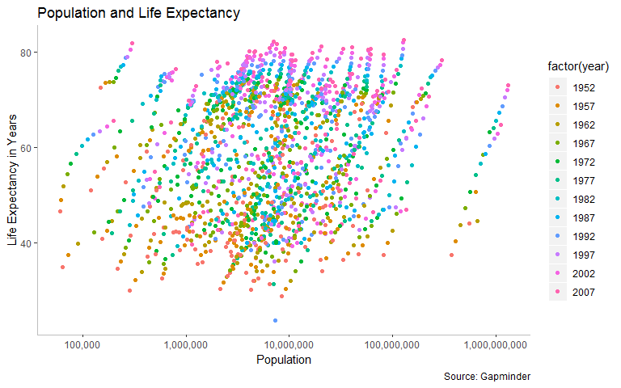

Chapter 3
================

I received Kieran Healy's *Data Visualization* book for Christmas so will be going through each chapter and highlighting some pointers for making ggplots that I will be able to use for future reference.

The following visualizations look at the \[Gapminder\] (<https://www.gapminder.org/>) dataset which includes data on life expectancy, GDP per capita, and population by country.

``` r
head(gapminder)
```

    ## # A tibble: 6 x 6
    ##   country     continent  year lifeExp      pop gdpPercap
    ##   <fct>       <fct>     <int>   <dbl>    <int>     <dbl>
    ## 1 Afghanistan Asia       1952    28.8  8425333      779.
    ## 2 Afghanistan Asia       1957    30.3  9240934      821.
    ## 3 Afghanistan Asia       1962    32.0 10267083      853.
    ## 4 Afghanistan Asia       1967    34.0 11537966      836.
    ## 5 Afghanistan Asia       1972    36.1 13079460      740.
    ## 6 Afghanistan Asia       1977    38.4 14880372      786.

It's important to note that the data is in a "tidy" and "long" format, which is the easiest structure for creating plots in ggplot2.

Graph 1
-------

``` r
p <- ggplot(data = gapminder, mapping = aes(x = gdpPercap, y = lifeExp))
p + geom_point()
```



``` r
ggsave(here("figures", "lifeexp_vs_gradient.pdf"))
```

    ## Saving 8 x 5 in image

I'd like to see which countries represent the outliers in this graph.

``` r
gapminder[which.min(gapminder$lifeExp),]
```

    ## # A tibble: 1 x 6
    ##   country continent  year lifeExp     pop gdpPercap
    ##   <fct>   <fct>     <int>   <dbl>   <int>     <dbl>
    ## 1 Rwanda  Africa     1992    23.6 7290203      737.

``` r
gapminder[which(gapminder$country=="Rwanda"),]
```

    ## # A tibble: 12 x 6
    ##    country continent  year lifeExp     pop gdpPercap
    ##    <fct>   <fct>     <int>   <dbl>   <int>     <dbl>
    ##  1 Rwanda  Africa     1952    40   2534927      493.
    ##  2 Rwanda  Africa     1957    41.5 2822082      540.
    ##  3 Rwanda  Africa     1962    43   3051242      597.
    ##  4 Rwanda  Africa     1967    44.1 3451079      511.
    ##  5 Rwanda  Africa     1972    44.6 3992121      591.
    ##  6 Rwanda  Africa     1977    45   4657072      670.
    ##  7 Rwanda  Africa     1982    46.2 5507565      882.
    ##  8 Rwanda  Africa     1987    44.0 6349365      848.
    ##  9 Rwanda  Africa     1992    23.6 7290203      737.
    ## 10 Rwanda  Africa     1997    36.1 7212583      590.
    ## 11 Rwanda  Africa     2002    43.4 7852401      786.
    ## 12 Rwanda  Africa     2007    46.2 8860588      863.

The country with the lowest life expectancy is Rwanda but they only have 12 observations so that may be skewing the data significantly.

``` r
gapminder[which.max(gapminder$lifeExp),]
```

    ## # A tibble: 1 x 6
    ##   country continent  year lifeExp       pop gdpPercap
    ##   <fct>   <fct>     <int>   <dbl>     <int>     <dbl>
    ## 1 Japan   Asia       2007    82.6 127467972    31656.

``` r
gapminder[which.max(gapminder$gdpPercap),]
```

    ## # A tibble: 1 x 6
    ##   country continent  year lifeExp    pop gdpPercap
    ##   <fct>   <fct>     <int>   <dbl>  <int>     <dbl>
    ## 1 Kuwait  Asia       1957    58.0 212846   113523.

The country with the highest life expectancy is Japan and the country with the maximum gdpPercap is Kuwait.

Graph 2
-------

``` r
p + geom_point(color = "gray", alpha = 0.3) + 
    geom_smooth(method = "gam", se = FALSE, color = "orange") +
    scale_x_log10(labels = scales::dollar) +
    labs(x = "GDP Per Capita", y = "Life Expectancy in Years",
        title = "Economic Growth and Life Expectancy",
        subtitle = "Data points are country-years",
        caption = "Source: Gapminder") +
    theme(panel.background = element_blank(),
          axis.line = element_line(size = 0.5, linetype = "solid", color = "gray"))
```



-   The scales package has a handy function `dollar` that converts the x-axis to dollars.
-   The `element_blank` function can be used to get rid of unwanted grids, backgrounds, etc

Graph 3
-------

Mapping aesthetics can be used both in the initial ggplot call and in the individual geoms. BUt remember that if it is called in the initial call, then all geoms layered on top of the original plot object will inherit that object's mappings.

``` r
p + geom_point(mapping = aes(color = continent)) +
    geom_smooth(method = "loess", se = FALSE) +
    scale_x_log10(labels = scales::dollar) +
    labs(x = "GDP Per Capita", y = "Life Expectancy in Years",
        title = "Economic Growth and Life Expectancy",
        subtitle = "Data points are country-years",
        caption = "Source: Gapminder") +
    theme(panel.background = element_blank(),
          axis.line = element_line(size = 0.5, linetype = "solid", color = "gray"))
```



Color can also be mapped to a continuous variable to create a continouos color gradient.

``` r
p + geom_point(mapping = aes(color = log(pop))) +
    geom_smooth(method = "loess", se = FALSE, color = "orange") +
    scale_x_log10(labels = scales::dollar) +
    labs(x = "GDP Per Capita", y = "Life Expectancy in Years",
        title = "Economic Growth and Life Expectancy",
        subtitle = "Data points are country-years",
        caption = "Source: Gapminder") +
    theme(panel.background = element_blank(),
          axis.line = element_line(size = 0.5, linetype = "solid", color = "gray"))
```



Graph 4
=======

``` r
p2 <- ggplot(data = gapminder, mapping = aes(x = pop, y = lifeExp))
p2 + geom_point(mapping = aes(color = factor(year))) +
  scale_x_log10(labels = scales::comma) +
    labs(x = "Population", y = "Life Expectancy in Years",
        title = "Population and Life Expectancy",
                caption = "Source: Gapminder") +
    theme(panel.background = element_blank(),
          axis.line = element_line(size = 0.5, linetype = "solid", color = "gray"))
```



Year seems to play a big role in life expectancy regardless of the continent. Life expectancy goes up when looking at later years.
